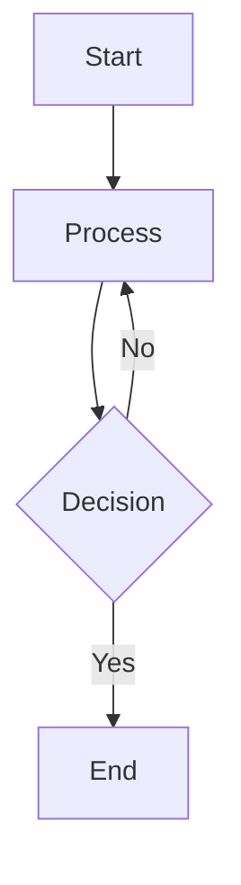
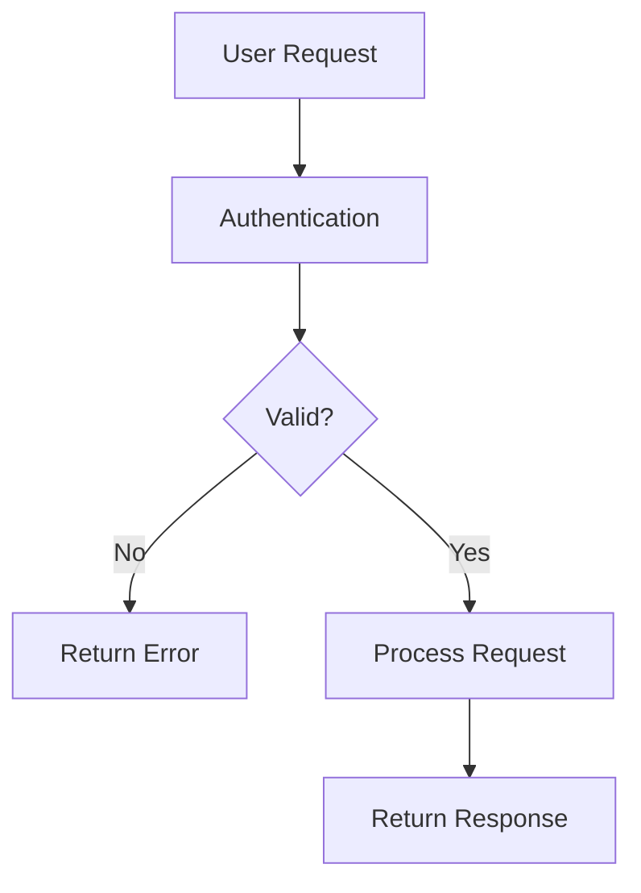
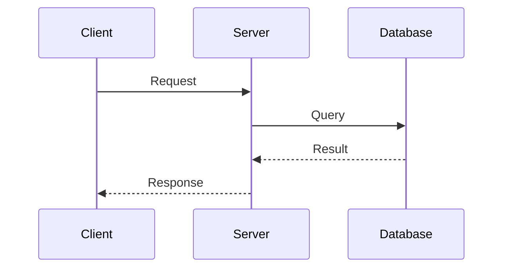

# Markdown Reference Guide

Complete documentation of all markdown features supported by Noobly JS Core's custom markdown parser.

## Table of Contents

1. [Standard Markdown](#standard-markdown)
2. [Custom Block Types](#custom-block-types)
   - [Header / Navigation](#header--navigation)
   - [Footer](#footer)
   - [Hero Banner](#hero-banner)
   - [Cards Grid](#cards-grid)
   - [Wiki-Links](#wiki-links)
   - [Container Layouts](#container-layouts)
   - [Swagger/OpenAPI](#swaggeropenapi)
   - [Mermaid Diagrams](#mermaid-diagrams)

---

## Standard Markdown

All standard markdown syntax is supported:

### Headings
```markdown
# Heading 1
## Heading 2
### Heading 3
#### Heading 4
##### Heading 5
###### Heading 6
```

### Text Formatting
```markdown
**Bold text**
*Italic text*
***Bold and italic***
~~Strikethrough~~
`Inline code`
```

### Lists
```markdown
- Unordered list item
- Another item
  - Nested item

1. Ordered list
2. Second item
   1. Nested ordered
```

### Links and Images
```markdown
[Link text](https://example.com)

```

### Code Blocks
```markdown
    Regular code block (indented)
```

### Blockquotes
```markdown
> This is a quote
> Multiple lines supported
```

### Horizontal Rule
```markdown
---
```

### Tables
```markdown
| Column 1 | Column 2 |
|----------|----------|
| Cell 1   | Cell 2   |
| Cell 3   | Cell 4   |
```

---

## Custom Block Types

Custom blocks are markdown code fences with specific block type identifiers. They enable advanced layouts and features.

### Header / Navigation

Creates a responsive navigation bar with logo, title, and links.

**Syntax:**
```markdown
```header
  icon: /path/to/logo.png
  title: Site Title
  links: [Home](/) [Documentation](/docs) [GitHub](https://github.com)
```
```

**Properties:**
| Property | Required | Type | Description |
|----------|----------|------|-------------|
| `icon` | ❌ | String | Path to logo image |
| `title` | ✅ | String | Navigation bar title |
| `links` | ❌ | String | Markdown links separated by spaces |

**Example:**
```markdown
```header
  icon: /images/logo.png
  title: Knowledge Platform
  links: [Services](/services) [API](/api) [Docs](/docs)
```
```

**Features:**
- Responsive design (collapses on mobile)
- Sticky positioning
- Auto-formatted navigation links
- Logo with custom styling

---

### Footer

Creates a footer section with branding, information, and links.

**Syntax:**
```markdown
```footer
  icon: /path/to/logo.png
  title: Company Name
  subtitle: Copyright and legal information
  links: [Link 1](url) [Link 2](url)
```
```

**Properties:**
| Property | Required | Type | Description |
|----------|----------|------|-------------|
| `icon` | ❌ | String | Logo image path |
| `title` | ✅ | String | Footer title/company name |
| `subtitle` | ❌ | String | Legal text, copyright, etc. |
| `links` | ❌ | String | Markdown links |

**Example:**
```markdown
```footer
  icon: /images/logo.png
  title: NooblyJS
  subtitle: © 2026. All rights reserved.
  links: [Privacy](/) [Terms](/) [Contact](/contact)
```
```

**Features:**
- Two-column layout (logo + links on right)
- Professional styling
- Responsive design

---

### Hero Banner

Large, eye-catching section with title, subtitle, and optional image.

**Syntax:**
```markdown
```hero-banner
  title: Main Heading
  subtitle: Descriptive subtitle
  hero-image: /path/to/image.png
  hero-image-align: right
```
```

**Properties:**
| Property | Required | Type | Description |
|----------|----------|------|-------------|
| `title` | ✅ | String | Large heading text |
| `subtitle` | ❌ | String | Smaller descriptive text |
| `hero-image` | ❌ | String | Path to image file |
| `hero-image-align` | ❌ | String | `left` or `right` (default: `right`) |

**Example:**
```markdown
```hero-banner
  title: Enterprise Backend Framework
  subtitle: Production-ready services with dependency injection
  hero-image: /images/hero.png
  hero-image-align: right
```
```

**Features:**
- Gradient background
- Image drop shadow
- Responsive layout (stacks on mobile)
- Large, impactful typography

---

### Cards Grid

Display content as a responsive grid of cards.

**Syntax:**
```markdown
```cards
  across: 3

  - ### Card Title
    Card description and content.
    - Bullet points
    - Are supported

  - ### Another Card
    More card content here.
```
```

**Properties:**
| Property | Required | Type | Description |
|----------|----------|------|-------------|
| `across` | ❌ | Number | Cards per row (1-6, default: 3) |

**Card Structure:**
- Each card starts with `-`
- First heading (`###` or `##`) becomes the card title
- Remaining content is the card body
- Supports all markdown formatting

**Example:**
```markdown
```cards
  across: 3

  - ### Feature One
    Description of the first feature.
    - Supports lists
    - Multiple items

  - ### Feature Two
    Another feature description.

  - ### Feature Three
    Third feature with details.
```
```

**Responsive Layout:**
| Screen | Columns | Property |
|--------|---------|----------|
| Desktop (>992px) | 3 | `col-lg-4` |
| Tablet (768px-992px) | 2 | `col-md-6` |
| Mobile (<768px) | 1 | Single column |

---

### Wiki-Links

Interactive document cards that load markdown files in a modal popup.

**Syntax (Single):**
```markdown
```wiki-link
  path: /documents/readme.md
  title: Documentation Title
  subtitle: Optional subtitle
  content: Preview text shown on the card
```
```

**Syntax (Multiple - separate with ---):**
```markdown
```wiki-link
  path: /doc1.md
  title: First Document
  content: Description

  ---

  path: /doc2.md
  title: Second Document
  content: Another description
```
```

**Properties:**
| Property | Required | Type | Description |
|----------|----------|------|-------------|
| `path` | ✅ | String | Path to markdown file (auto-resolved from `/docs`) |
| `title` | ✅ | String | Card title |
| `subtitle` | ❌ | String | Smaller text below title (italicized) |
| `content` | ❌ | String | Preview text (truncated to 3 lines) |

**Path Resolution:**
```
/readme.md              → /docs/readme.md
readme.md              → /docs/readme.md
/documents/api.md      → /docs/documents/api.md
documents/guide.md     → /docs/documents/guide.md
```

**Example:**
```markdown
```wiki-link
  path: /ARCHITECTURE.md
  title: System Architecture
  subtitle: Design patterns
  content: Learn how the system is organized.

  ---

  path: /API REFERENCE.md
  title: API Documentation
  subtitle: Complete endpoints
  content: All available API endpoints.
```
```

**Features:**
- Interactive cards with hover effects
- Click to open document in 90% modal
- Same markdown parser for consistency
- Mermaid diagram support in modal
- Responsive grid layout (3 cols desktop, 2 tablet, 1 mobile)

---

### Container Layouts

Two-column layout with 50/50 split.

**Syntax:**
```markdown
```container
  left
    ### Left Column
    Content for the left side.
    - Supports all markdown
    - Lists, code, etc.

  right
    ### Right Column
    Content for the right side.
```
```

**Alternative (with colons):**
```markdown
```container
  left:
    ### Left Column
    ...

  right:
    ### Right Column
    ...
```
```

**Features:**
- Equal width columns (50/50)
- Responsive (stacks on mobile)
- Full markdown support in each column

**Example:**
```markdown
```container
  left
    ### Advantages
    - Easy to implement
    - Well documented
    - Active community

  right
    ### Getting Started
    1. Install package
    2. Configure settings
    3. Start coding
```
```

---

### Three-Column Layout

Equal-width three-column layout (33/33/33).

**Syntax:**
```markdown
```three-column
  left
    ### Column 1
    First column content.

  middle
    ### Column 2
    Middle column content.

  right
    ### Column 3
    Right column content.
```
```

**Alternative (with colons):**
```markdown
```three-column
  left:
    ...
  middle:
    ...
  right:
    ...
```
```

**Features:**
- Three equal columns
- Responsive (2 cols on tablet, 1 on mobile)
- Full markdown support

**Example:**
```markdown
```three-column
  left
    ### Speed
    Lightning fast performance.

  middle
    ### Security
    Enterprise-grade security.

  right
    ### Scalability
    Built for growth.
```
```

---

### Two-Column Layout (75/25)

Asymmetric layout with main content on left (75%) and sidebar on right (25%).

**Syntax:**
```markdown
```two-col-3-1
  left
    ### Main Content
    This takes up 75% of the width.

  right
    ### Sidebar
    This sidebar is 25%.
```
```

**Alternative (with colons):**
```markdown
```two-col-3-1
  left:
    ...
  right:
    ...
```
```

**Features:**
- 75% left, 25% right split
- Responsive (stacks on mobile)
- Ideal for content + sidebar layout

**Example:**
```markdown
```two-col-3-1
  left
    ## Main Documentation
    Comprehensive guide with all details.
    - Feature 1
    - Feature 2
    - Feature 3

  right
    ### Quick Links
    - [Home](/home)
    - [Guide](/guide)
    - [API](/api)
```
```

---

### Two-Column Layout (25/75)

Asymmetric layout with sidebar on left (25%) and main content on right (75%).

**Syntax:**
```markdown
```two-col-1-3
  left
    ### Navigation
    - Item 1
    - Item 2

  right
    ### Main Content
    This takes up 75% of the width.
```
```

**Alternative (with colons):**
```markdown
```two-col-1-3
  left:
    ...
  right:
    ...
```
```

**Features:**
- 25% left, 75% right split
- Ideal for sidebar navigation + main content
- Responsive design

**Example:**
```markdown
```two-col-1-3
  left
    ### Table of Contents
    1. [Section 1](#s1)
    2. [Section 2](#s2)
    3. [Section 3](#s3)

  right
    ## Detailed Documentation
    Full content for each section goes here with examples and explanations.
```
```

---

### Swagger / OpenAPI

Embedded API documentation using Swagger UI.

**Syntax (with URL):**
```markdown
```swagger
  url: /path/to/openapi.json
  title: API Documentation
```
```

**Syntax (with inline OpenAPI spec):**
```markdown
```swagger
  title: My API

  openapi: 3.0.0
  info:
    title: My API
    version: 1.0.0
  paths:
    /api/users:
      get:
        summary: Get all users
        responses:
          '200':
            description: Success
```
```

**Properties:**
| Property | Required | Type | Description |
|----------|----------|------|-------------|
| `url` | ❌ | String | URL to OpenAPI/Swagger JSON file |
| `title` | ❌ | String | Documentation title |
| OpenAPI spec | ❌ | YAML/JSON | Inline OpenAPI specification |

**Features:**
- Interactive API explorer
- Try-it-out functionality
- Request/response examples
- Schema documentation
- Authentication configuration

**Example:**
```markdown
```swagger
  url: /docs/api-spec.json
  title: NooblyJS API
```
```

---

### Mermaid Diagrams

Create flowcharts, sequence diagrams, and other visualizations.

**Syntax:**
```markdown

```

**Diagram Types:**
- `graph` / `flowchart` - Flowcharts and graphs
- `sequenceDiagram` - Sequence diagrams
- `classDiagram` - Class diagrams
- `stateDiagram` - State diagrams
- `erDiagram` - Entity relationship diagrams
- `pie` - Pie charts
- `gantt` - Gantt charts

**Example Flowchart:**
```markdown

```

**Example Sequence:**
```markdown

```

**Features:**
- Automatic rendering
- Interactive diagrams
- Multiple diagram types
- Responsive scaling

---

## Advanced Features

### Combining Blocks

You can use multiple custom blocks in sequence:

```markdown
# Page Title

```hero-banner
  title: Welcome
  subtitle: To our platform
```

```cards
  across: 3
  - ### Feature 1
    Description
  - ### Feature 2
    Description
```

```container
  left
    ### Left Content
  right
    ### Right Content
```
```

### Markdown Inside Blocks

Most blocks support full markdown:

```markdown
```container
  left
    ### Heading
    **Bold text** and *italic text*
    - Lists
    - Are supported
    - With multiple items

    ```javascript
    // Code blocks too
    console.log('Hello');
    ```

  right
    More content with [links](https://example.com)
```
```

### Styling and Classes

Blocks use Bootstrap 5 classes for styling. The default color scheme is:
- **Primary**: `#059da2` (teal)
- **Secondary**: `#6c757d` (gray)

Customize these in `index.html`:
```css
:root {
    --custom-primary: #059da2;
    --custom-secondary: #6c757d;
}
```

---

## Best Practices

1. **Use semantic structure** - Use headers in logical order (h1, then h2, then h3)
2. **Break up content** - Use containers and cards to organize information visually
3. **Use wiki-links** - Link to other documentation documents from cards
4. **Keep it readable** - Avoid too much content per card or column
5. **Responsive design** - Test layouts on mobile devices
6. **Accessible** - Use descriptive link text and alt text for images

---

## Troubleshooting

### Block not rendering
- Check that block type name is exactly right
- Ensure proper markdown fence syntax (``` or ~~~)
- Verify closing fence is on its own line

### Content not showing
- Check for proper indentation in content
- Verify section markers (left:, right:, etc.) are correct
- Remove extra blank lines

### Styling issues
- Clear browser cache
- Check that Bootstrap CSS is loaded
- Verify custom color variables

---

## File Organization

For best results, organize markdown files like this:

```
docs/
├── index.md              # Main documentation page
├── API REFERENCE.md      # API documentation
├── ARCHITECTURE.md       # Architecture guide
├── USAGE GUIDE.md        # Usage guide
├── usage/
│   ├── markdown-reference.md  # This file
│   ├── quick-start.md
│   └── examples.md
└── detailed/
    ├── services/
    ├── guides/
    └── tutorials/
```

---

## Additional Resources

- [Bootstrap 5 Documentation](https://getbootstrap.com/docs/5.0/)
- [Marked.js Documentation](https://marked.js.org/)
- [Mermaid Diagram Syntax](https://mermaid.js.org/)
- [OpenAPI/Swagger Specification](https://swagger.io/specification/)

---

**Last Updated**: February 2026
**Version**: 1.0.0
**Status**: Complete
